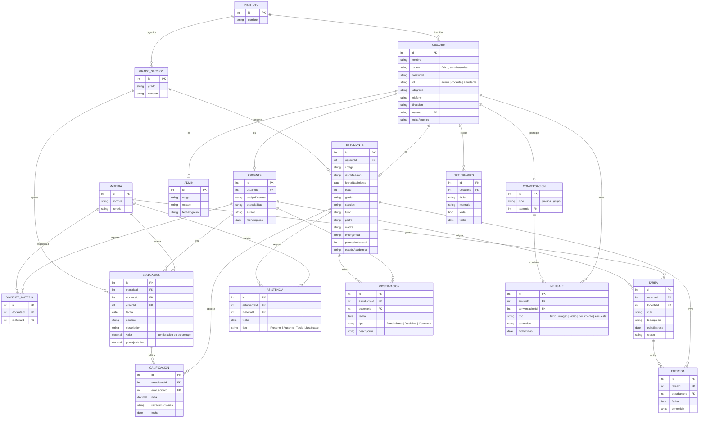
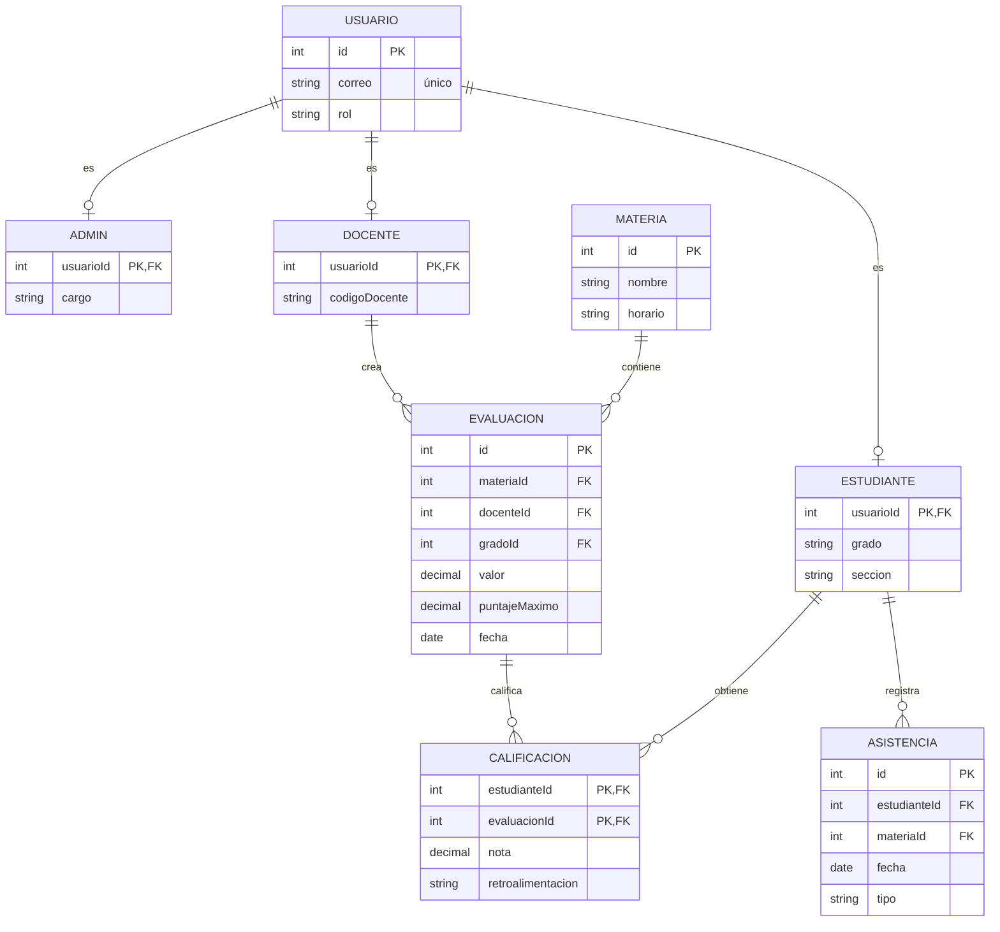
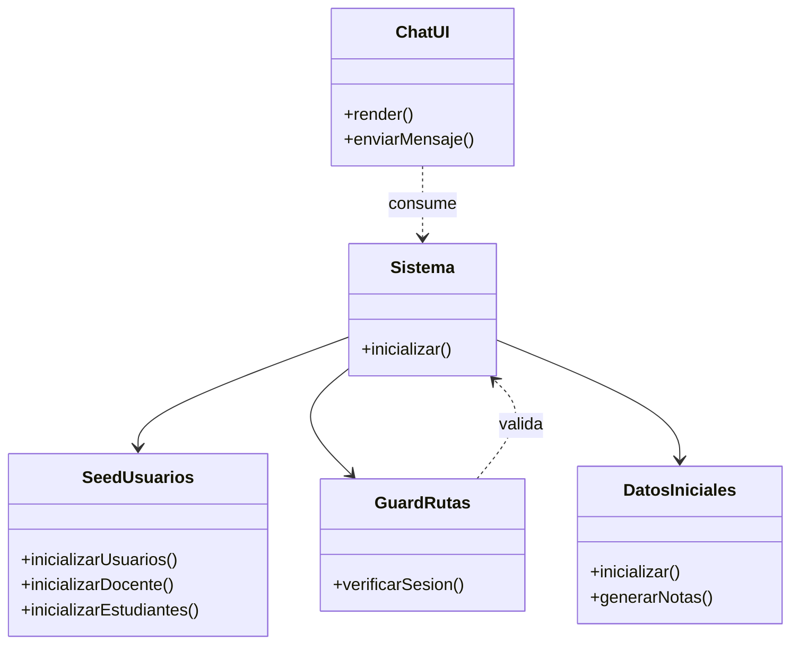

# Modelo de datos — Integra-net

Este documento es el entregable de **diseño de base de datos** de la validación.
Describe qué información guarda el sistema, cómo se relacionan las entidades y
hasta qué forma normal cumple el modelo.

---

## 1. Nota sobre la persistencia

Integra-net **no usa una base de datos relacional**. La persistencia es el
`localStorage` del navegador, y cada entidad se guarda en una clave propia con
prefijo `edu`:

| Clave | Contenido |
|---|---|
| `eduUsuarios` | Cuentas de acceso de los tres roles |
| `eduEstudiantes` | Ficha completa del alumnado |
| `eduDocente` | Ficha del docente |
| `eduMaterias` | Catálogo de los 8 módulos |
| `eduEvaluaciones` | Evaluaciones creadas por docente |
| `eduCalificaciones` | Notas registradas |
| `eduAsistencias` | Registro diario de asistencia |
| `eduObservaciones` | Observaciones de rendimiento y disciplina |
| `eduTareas` / `eduEntregas` | Tareas asignadas y trabajos enviados |
| `eduConversaciones`, `eduMensajes`, `eduGruposChat`, `eduEncuestasChat`, `eduChatTema` | Chat en tiempo real |
| `eduGrupos`, `eduGradosSecciones`, `eduInstitutos` | Estructura académica |
| `eduNotificaciones`, `eduEstadosUsuarios`, `eduAvatares`, `eduSesion` | Notificaciones, presencia, foto y sesión activa |

Es una decisión de prototipo, no una limitación de diseño: permite ejecutar el
proyecto sin servidor ni instalación. Aun así, **el modelo lógico se normalizó
hasta 2FN**, que es lo que se documenta a continuación.

---

## 2. Diagrama entidad-relación

---

## 3. Análisis de forma normal

### 3.1 Lo que incumple hoy

El modelo **almacenado** se desvía de la 2FN en cuatro puntos concretos:

**a) Grupos repetitivos en `ESTUDIANTE` (violación de 1FN → arrastra a 2FN).**
Cada estudiante guarda dentro un array `materias[]` con 8 entradas, y dentro de
cada una de ellas se anidan `evaluaciones[]`, `calificaciones[]` y
`observaciones[]`.
Son grupos repetitivos: el número de materias varía por estudiante, y 1FN exige
que cada atributo tenga un solo valor.

**b) Duplicación de la misma calificación en tres sitios.**
Una nota existe a la vez en `estudiante.materias[].calificaciones[]`, en
`eduCalificaciones` y —al ser el mismo objeto— también dentro de `eduUsuarios`.
Esto produce **anomalías de actualización**: si el docente corrige una nota en
su panel, no hay garantía de que las otras dos copias cambien.

**c) Dependencias transitivas en `CALIFICACION` (esto ya rompe 2FN).**
Cada nota almacena `puntajeMaximo`, `fecha`, `grado`, `seccion` y `docenteId`.
Todos esos valores se deducen de `evaluacionId`, así que dependen de la clave
compuesta sólo **a través** de la evaluación y no de la nota misma.

**d) Claves primarias no deterministas.**
El generador usa `Date.now()` dentro de la clave
(`cal_${estudianteId}_${ev.id}_${Date.now()}`). Una clave que cambia en cada
ejecución no es estable y rompe la trazabilidad de la entidad.

### 3.2 Modelo normalizado propuesto

Las correcciones son extracciones, no rediseños:

- `ESTUDIANTE` conserva **solo** sus atributos propios (nombre, grado, sección,
  tutor, contactos). Sin arrays anidados.
- `EVALUACION` pasa a ser entidad propia, con clave propia y referencia a
  `materiaId`, `docenteId` y `gradoId`.
- `CALIFICACION` queda con clave **(estudianteId, evaluacionId)** y solo tres
  atributos: `nota`, `retroalimentacion` y `fecha`. Todo lo demás se deduce de la
  relación con `EVALUACION`, así que no se repite en cada nota.
- `ASISTENCIA` y `OBSERVACION` dejan de estar embebidas en el estudiante.
- `USUARIO` se separa de sus extensiones: `ADMIN`, `DOCENTE` y `ESTUDIANTE` quedan
  como tablas que heredan la clave de `USUARIO`, de modo que lo propio de cada
  rol no se almacena dos veces.

Con esto toda tabla tiene clave primaria simple y sus atributos no clave
dependen de la clave completa. **El modelo cumple 1FN y 2FN.**

### 3.3 Diagrama del modelo normalizado

### 3.4 Impacto medido

El tamaño de los datos iniciales, medido ejecutando el inicializador del proyecto:

| Clave | Tamaño actual |
|---|---|
| `eduUsuarios` | 600,7 KB |
| `eduEstudiantes` | 600,0 KB |
| `eduEvaluaciones` | 239,5 KB |
| `eduCalificaciones` | 217,6 KB |
| `eduAsistencias` | 43,7 KB |
| Resto de claves | 8,9 KB |
| **Total** | **1.710,4 KB** (33,4 % de la cuota de 5 MB) |

Con 23 usuarios, 21 estudiantes, 8 módulos, **840 evaluaciones** y **840
calificaciones** generadas.

Aplicando la normalización descrita en 3.2, el total baja a **562,7 KB**, un
**ahorro del 67,1 %** (1.147,7 KB). La reducción viene casi entera de
`eduUsuarios` y `eduEstudiantes`, que pasan de unos 600 KB a unos 26 KB cada uno
al dejar de llevar dentro las evaluaciones y las calificaciones.

Además de espacio, la normalización elimina las anomalías de actualización del
apartado 3.1(b).

---

## 4. Diagrama de clases de la capa de dominio

Como complemento al modelo relacional, las entidades se manipulan en JavaScript
con clases sin constructor de argumentos, que leen de `localStorage`:

